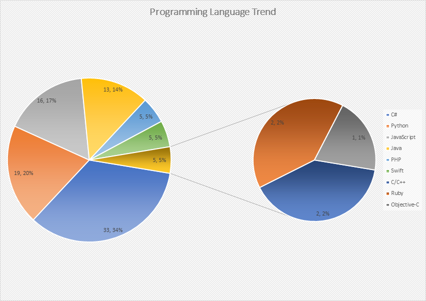

# Developer surveys

## Programming language trend

[PUCIT](https://pucit.edu.pk/) (Punjab university college of information technology) is the leading university of Pakistan in producing Tech resources in various fields of computer science including computer research, software development and software management etc. PUCIT graduates created hundreds of software export companies and most of them are working as software engineer to software architect in reputed companies of Pakistan hence taking part uplifting Pakistan economy and export.

This month we conducted a small survey by posting poll on semi-official Facebook [group](https://web.facebook.com/groups/PUCITian/) of PUCIT graduates/Alumni to learn growing programming language trends. Here you can see still C# (.net) is the top priority of PUCIT graduates following by Python, JavaScript and Java.

